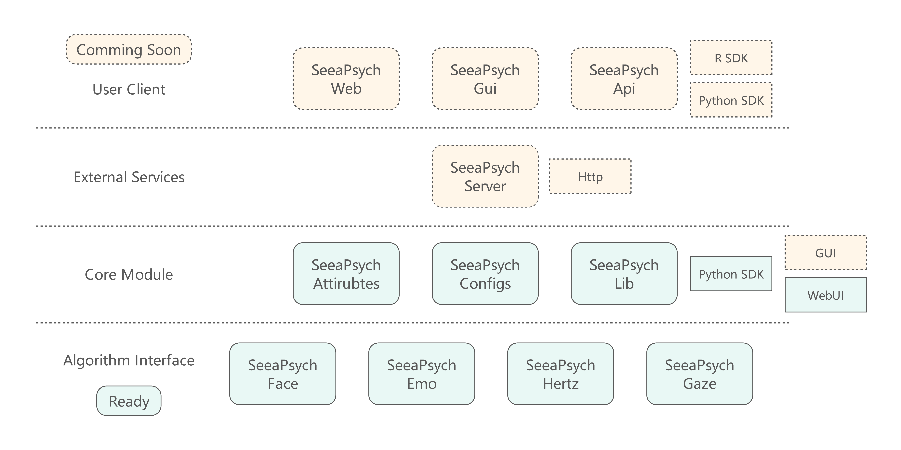
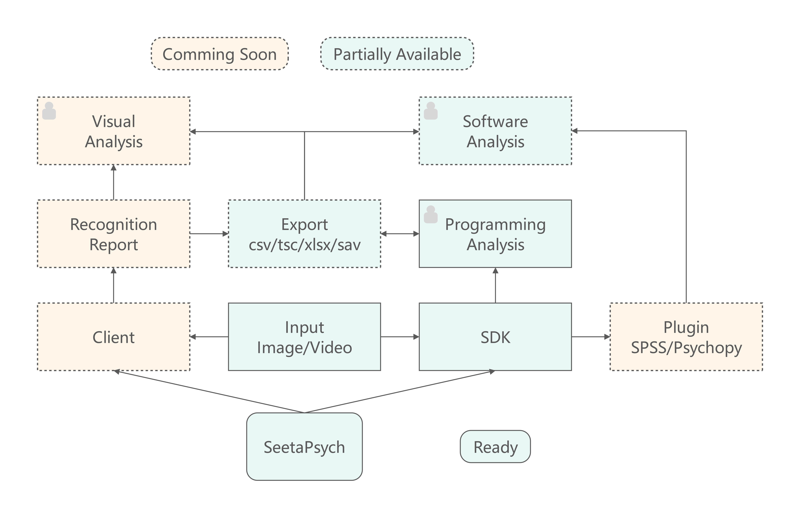
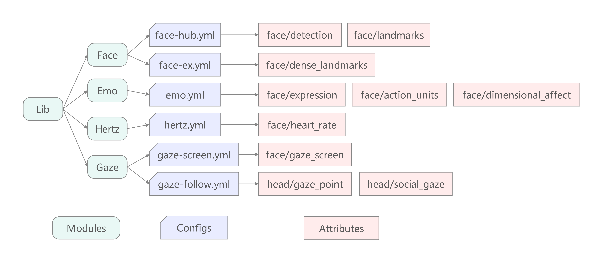
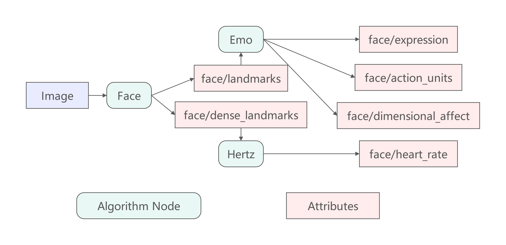

# SeetaPsych Lib

> 基于行为的心理测量开源视觉工具箱

简体中文 | [English](README.md)

[](pyproject.toml)
[](LICENSE)
[](https://arxiv.org/abs/2609.19719)
[](https://arxiv.org/pdf/2609.19719)

SeetaPsych Lib 是 SeetaPsych 项目的核心库，基于 Python 构建，面向基于行为的心理测量场景。它提供一套模块化的 Pipeline / Runner 运行时框架，支持灵活组合与执行自定义算法模块，并内置开箱即用的 WebUI，便于快速上手与实验探索。

SeetaPsych 的技术报告已发布在 [arXiv](https://arxiv.org/abs/2609.19719)（[PDF](https://arxiv.org/pdf/2609.19719)）。

## 概述

作为 SeetaPsych 生态的基础库，其在整个开源项目矩阵中的位置如 [图 1](#figure-matrix) 所示。

<div align="center" id="figure-matrix">
  
  <p><em><strong>图 1</strong> 开源项目矩阵</em></p>
</div>

本项目针对以下主要应用场景提供解决方案，概括如 [图 2](#figure-usage) 所示。

<div align="center" id="figure-usage">
  
  <p><em><strong>图 2</strong> 目标使用场景</em></p>
</div>

本项目通过配置文件描述可用算法及其可输出的属性。属性（attribute）即算法或处理方法产生的输出结果。

[图 3](#figure-attributes) 展示了如何通过配置文件（YML）描述算法与属性。

<div align="center" id="figure-attributes">
  
  <p><em><strong>图 3</strong> 配置文件（YML）及其对应属性示例</em></p>
</div>

例如，Face 模块下的 `face-hub.yml` 提供两个属性 — `face/detection` 与 `face/landmarks`。如下所示，`face/detection` 属性包含检测到的人脸边界框（`xyxy`）及其置信度评分：

```json
{
  "face_detection": [
    {
      "xyxy": [
        128.772,
        158.999,
        286.546,
        369.401
      ],
      "score": 0.802
    }
  ]
}
```

SeetaPsych 属性在 [seetapsych-attributes](https://github.com/seetapsych/seetapsych-attributes) 仓库中定义与维护。
共享配置文件（configs）位于 [seetapsych-configs](https://github.com/seetapsych/seetapsych-configs) 仓库。

这些 YML 配置文件属于框架内部管理机制，一般无需终端用户手动修改——框架会在需要时自动获取。

每个属性可能依赖一个或多个算法模块进行计算。

**框架的核心优势是依赖驱动的自动化编排：** 用户只需声明所需的目标属性，框架便会根据这些属性及其依赖关系，自动解析出所有必要的算法模块，并将它们组装成经过优化的计算图。具体示例如 [图 4](#figure-graph) 所示。

<div align="center" id="figure-graph">
  
  <p><em><strong>图 4</strong> 根据请求属性构建的计算图示例</em></p>
</div>

计算图由 Runner 负责执行，处理图像或视频并输出所请求的属性。默认情况下，Runner 会自动检测当前硬件环境，检测到支持的 GPU 时会优先启用 GPU 加速进行推理。

[图 4](#figure-graph) 示例对应的依赖链如下：
- 输入图像先经 Face 模块处理，生成 `face/landmarks`（5 点关键点）与 `face/dense_landmarks`（密集关键点）。
- `face/landmarks` 送入 Emo 模块，输出 `face/expression`（表情）、`face/action_units`（动作单元）与 `face/dimensional_affect`（效价-唤醒维度情感）。
- `face/dense_landmarks` 送入 Hertz 模块，用于估计 `face/heart_rate`（心率）属性。

基于依赖的组织方式使得同一计算图内的多个属性可以共享并复用中间结果，从而避免重复计算。

内置算法模块以独立子项目形式实现，每个子项目提供一个或多个算法包（通过 `modules/*.yml` 声明），并在全局配置注册表中完成注册。当前可用的算法子项目如下：
- [FaceHub](https://github.com/seetapsych/seetapsych-face-hub) — 人脸检测（RetinaFace / MediaPipe）、5 点关键点、468 点 3D 人脸网格、ArcFace 512 维人脸特征提取。
- [FaceEx](https://github.com/seetapsych/seetapsych-face-ex) — 280 点密集人脸关键点预测，支持可选的二次精修流程。
- [Emo](https://github.com/seetapsych/seetapsych-emo) — 多任务面部情感估计：16 个动作单元（AU）、7 类离散表情分类、效价-唤醒维度情感回归。
- [GazeScreen](https://github.com/seetapsych/seetapsych-gaze-screen) — 桌面眼动场景下基于 AFFNet 与 TDGazeNet 的屏幕注视坐标估计。
- [GazeFollow](https://github.com/seetapsych/seetapsych-gaze-follow) — 多人头检测、逐人场景级注视跟随、双人社交注视关系分类。
- [Hertz](https://github.com/seetapsych/seetapsych-hertz) — 基于 rPPG 的非接触式心率估计（TinyHR 卷积波形预测器 与 AdaChrom 色度分析）。

关于共享 schema、属性契约以及全局模块注册表的详细说明，请参考以下仓库：
- [seetapsych-attributes](https://github.com/seetapsych/seetapsych-attributes)
- [seetapsych-configs](https://github.com/seetapsych/seetapsych-configs)

## 运行要求

- Python >= 3.10
- （推荐）uv 包管理器：<https://github.com/astral-sh/uv>

## 安装

### 创建虚拟环境

安装依赖前，建议使用隔离的虚拟环境。

#### 使用 uv（推荐）

```sh
# 在 .venv 处创建虚拟环境
uv venv

# 激活（bash/zsh）
source .venv/bin/activate

# 激活（PowerShell）
.venv\Scripts\Activate.ps1

# 激活（Windows CMD）
.venv\Scripts\activate.bat
```

#### 使用标准 venv

```sh
python -m venv .venv

# bash/zsh
source .venv/bin/activate

# PowerShell
.venv\Scripts\Activate.ps1

# Windows CMD
.venv\Scripts\activate.bat
```

#### 使用 conda

```sh
conda create -n seetapsych python=3.10
conda activate seetapsych
```

### 安装依赖

安装所需依赖：

- seetapsych-lib
- seetapsych-attributes
- seetapsych-configs

若要运行 WebUI，需安装 `seetapsych-lib[webui]` 包。

#### 使用 uv（推荐）

```sh
uv pip install 'seetapsych-lib[webui]' seetapsych-attributes seetapsych-configs
```

#### 使用 pip

```sh
pip install 'seetapsych-lib[webui]' seetapsych-attributes seetapsych-configs
```

### 安装默认配置

```sh
# 下载默认模块配置
seetapsych-manager download
# 安装各模块运行所需依赖
seetapsych-manager setup
# 缓存各算法模型文件
seetapsych-manager cache
```

`setup` 与 `cache` 命令并非必须执行。在后续使用 WebUI 或以编程方式调用时，`seetapsych-lib` 会根据实际需要自动安装依赖并下载模型。

## 公共资源

随 `seetapsych-lib` 一同安装的默认模块定义，由 <https://github.com/seetapsych/seetapsych-configs> 仓库发布与维护。

如需将内置模块升级至最新版本，请先升级 configs 包，再重新下载配置：

```sh
# 将已安装的 seetapsych-configs 升级至最新版本
# 使用纯 pip 时请执行：pip install --upgrade seetapsych-configs
uv pip install --upgrade seetapsych-configs
# 重新下载最新的模块定义
seetapsych-manager download -f
```

算法的输入与输出通过「属性（Attributes）」进行契约定义。完整的 Attributes 规范见 <https://github.com/seetapsych/seetapsych-attributes>。

## 快速开始

### 运行 WebUI（Streamlit）

```sh
seetapsych-webui --log INFO
```

或

```sh
python -m seetapsych_lib.webui --log INFO
```

本地浏览器窗口会自动打开，也可手动访问：`http://localhost:8501`。

常用参数：

- `--dirs <DIR...>`：从目录加载模块
- `--files <FILE...>`：从本地配置文件加载模块
- `--urls <URL...>`：从远程 URL 加载模块
- `--disable-builtin`：禁用内置模块
- `--disable-default`：禁用默认模块
- `--cache-dir <DIR>`：模型缓存目录
- `--upload-dir <DIR>`：上传目录
- `--log <LEVEL>`：日志级别（如 `DEBUG`、`INFO`、`WARNING`，或整数如 `10`）

### 编程使用

```python
# -*- coding: utf-8 -*-

import json
import cv2

from seetapsych_lib.runtime.factory import Factory
from seetapsych_lib.runtime.pipeline import Pipeline
from seetapsych_lib.runtime.runner import Runner
from seetapsych_lib.runtime.parallel_runner import ParallelRunner


def main():
    # 初始化时默认加载所有已安装的算法模块
    # 也可使用 load_xxx_module(s) 系列方法按需加载指定模块
    factory = Factory()

    # 快速构建工作流，声明目标属性为人脸检测 'face/detection'
    # 全部可用属性可通过 'seetapsych-manager show' 命令查看
    # 各属性的结果字段定义见 https://github.com/seetapsych/seetapsych-attributes
    pipeline = Pipeline(factory, attributes=["face/detection"])

    # 检查当前工作流是否存在待解决的依赖或缺失项
    print(pipeline.problem())
    # 解析工作流依赖，自动补齐人脸检测模块及对应模型
    pipeline.solve()

    # 检查当前环境是否满足运行要求（如有缺失则需安装或下载）
    print(pipeline.satisfied())
    # 安装当前流水线运行所需的缺失依赖
    pipeline.install_requirements()
    # 缓存流水线运行所需的模型文件
    pipeline.cache_models()

    # 设置算法参数
    package = pipeline.get_package(provide="face/detection")
    assert package is not None
    pipeline.set_parameters(package.uid, {"input_size": [640, 640]})

    # 创建基础执行器（单线程/单进程）
    runner = Runner(pipeline)
    # 如需更高吞吐，可改用并行执行器
    # runner = ParallelRunner(pipeline)

    # 执行算法推理
    report = runner.run(data={"default": cv2.imread("image.jpg")})

    # 输出执行结果
    print(json.dumps(report, indent=2, ensure_ascii=False))


if __name__ == "__main__":
    main()
```

## 内置模块

本库还附带内置算法模块。完整列表与文档见 [MODULES_CN.md](MODULES_CN.md)。

## 配置

### 环境变量

框架支持以下环境变量：

| 环境变量 | 说明 |
| :-- | :-- |
| SEETAPSYCH\_LOG\_LEVEL  | 设置默认日志级别。取值：`WARNING`、`INFO`、`DEBUG`，或整数级别（如 `10` 表示 DEBUG）。 |
| SEETAPSYCH\_CACHE\_DIR  | 模型缓存根目录。模型实际缓存于 `<CACHE_DIR>/models` 子目录下。 |
| SEETAPSYCH\_CONFIG\_DIR | 配置文件根目录。配置从 `<CONFIG_DIR>/configs` 子目录加载。 |

## 开发

### 文档字符串（docstring）规范

本项目所有代码 `docstring` 统一采用 **Google 风格** 格式（包含 `Args` / `Returns` / `Raises` 等段落）。完整规范请参考 [Google Python Style Guide](https://google.github.io/styleguide/pyguide.html#38-comments-and-docstrings)。

### 补充开发说明

本地验证流程（lint、类型检查、测试、构建）、标签命名规范以及发布流水线说明，请参见 [DEVELOPMENT.md](DEVELOPMENT.md)。
